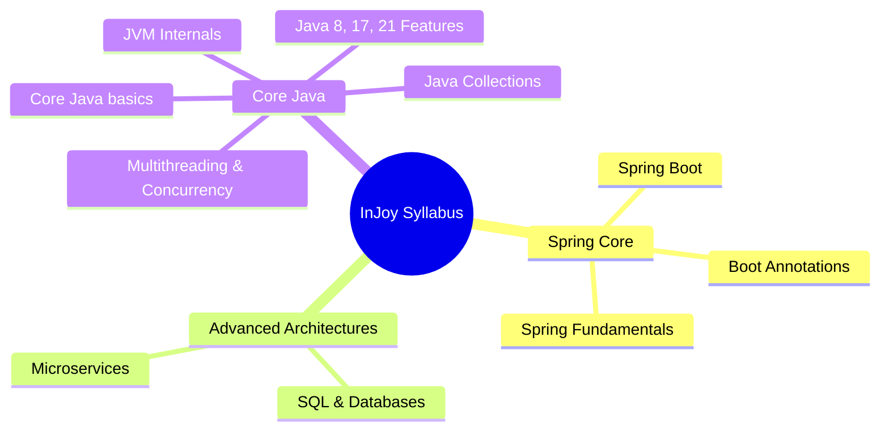

<!-- ========== NEW: ANIMATED WAVE HEADER ========== -->
<p align="center">
  
</p>

<!-- ========== NEW: TYPING ANIMATION INTRO ========== -->
<p align="center">
  
</p>

<!-- ========== NEW: AUTHOR & ARCHITECT SECTION ========== -->
## 👨‍💻 Author & Architect

<table>
<tr>
<td align="center" width="160">
  <a href="https://github.com/Sadique721">
    <br>
    <b>Md Sadique Amin</b><br>
    <sub>Backend Java Developer</sub>
  </a>
</td>
<td>

**Md Sadique Amin** — Backend Java Developer.

- 🔗 GitHub: [@Sadique721](https://github.com/Sadique721)
- 📧 Email: mdsadiqueamin721786@gmail.com
- 🏗️ Built: Enterprise BSS-OSS Telecom Suite, Backend Java Developer, IR Interconnect & Roaming

</td>
</tr>
</table>

---

<p align="center">
  
</p>

<p align="center">
  
  
  
  
  
  
  
</p>

<p align="center">
  
</p>

<p align="center">
  
  
  
  
</p>

---

## 👨‍💻 Author & Architect

<table>
<tr>
<td align="center" width="160">
  <a href="https://github.com/Sadique721">
    <br>
    <b>Md Sadique Amin</b><br>
    <sub>Software Engineer & Full-Stack Architect</sub>
  </a>
</td>
<td>

**Md Sadique Amin** — Software Engineer, Telecom & Full-Stack Cloud Architect, AI Systems Developer.

- 🔗 GitHub: [@Sadique721](https://github.com/Sadique721)
- 📧 Email: mdsadiqueamin721786@gmail.com
- 🏗️ Built: Enterprise BSS-OSS Telecom Suite, Diameter Protocol Engine, Angular & Flutter Apps, MSA AI Ecosystem

</td>
</tr>
</table>

---

<div align="center">


# 🚀 InJoy & Read & Play — Interactive Java & Spring Universe

<p align="center">
  
  
  
  
  
</p>

<p align="center">
  <strong>High-Fidelity Technical Curriculum disguised as an Interactive Unlocking Admin Portal</strong>
</p>

<p align="center">
  <a href="#-what-is-injoy">📖 Overview</a> •
  <a href="#-curriculum-modules">🎯 Curriculum</a> •
  <a href="#-key-features">✨ Features</a> •
  <a href="#-tech-stack">🛠 Tech Stack</a> •
  <a href="#-project-structure">🗂 Project Structure</a> •
  <a href="#-quick-start">🚀 Quick Start</a>
</p>

---

</div>

## 📖 What is InJoy?

**InJoy & Read & Play** is an advanced, production-grade educational platform built with **Angular 21** and **Tailwind CSS v4**. It features a unique gamified experience: the learning interface is designed as an **Admin Panel for a Simulated Mobile Unlocking System**. 

Clicking on simulated device unlocking orders (e.g., *Samsung KG Unlock*, *Xiaomi Bootloader Unlock*, *Oppo IMEI Repair*) redirects you to comprehensive, FAANG-level educational modules on Java and Spring Boot. The application features real-time search, sidebar curriculum drawers, step-by-step interactive timelines, custom code illustrations, and a dedicated **Interview Q&A Vault** featuring complete search, categorization, pagination, and progress tracking.

---

## 🎯 Curriculum Modules

The platform guides developers from foundational Java concepts to production-ready enterprise architectures across **10 premium modules**:



### Module Breakdown
1. 🍃 **Spring Framework Fundamentals**: Deep dive into Dependency Injection, IoC Containers, and Bean Lifecycle.
2. ⚡ **Spring Boot**: Bootstrap configuration, web application components, and automated setups.
3. 🏷️ **Spring Boot Annotations**: Detailed references on core annotations (`@Component`, `@Autowired`, `@Configuration`).
4. 🌐 **Microservices Architecture**: Service registries (Eureka), API Gateways, and Resilience patterns (Circuit Breakers).
5. 📦 **Java Collections Framework**: Custom data structures, List/Set/Map internals, and performance metrics.
6. 🚀 **Java 8, 17, 21 Features**: Lambdas, Streams, Records, Pattern Matching, and Sealed Classes.
7. 🧵 **Multithreading & Concurrency**: Virtual Threads, Thread Pools, and Executors.
8. 💾 **SQL & Database**: Query optimization, transactional behavior, and JPA/Hibernate mapping.
9. ⚙️ **JVM Internals**: Garbage collection algorithms, memory layouts, and class loaders.
10. 🧱 **Core Java Basics**: Basic syntax, OOP implementation, and core runtime concepts.

---

## ✨ Key Features

### 🖥️ Dynamic Simulated Dashboard
- **Admin Dashboard Layout**: A premium admin interface showing Pending, Processing, Success, and Rejected device unlocking orders.
- **Contextual Redirection**: Clicking a simulated order launches its linked curriculum topic (e.g. `what-is-spring`, `bean-lifecycle`).
- **Curriculum Drawer**: A slide-out panel allowing users to filter, search, and navigate through the syllabus topics at any time.

### 📊 Reactive State & Learning Progress
- **Angular Signals**: The application tracks visited topics and completed Q&A progress fully reactively using the new Angular Signals API.
- **LocalStorage Persistence**: Progress is saved locally in the browser (`injoy_progress`) to maintain states across sessions.

### 📖 Interactive Reader Template
- **Timeline Step Navigations**: Multi-part syllabus steps presented through beautiful timeline views.
- **Code Illustrations**: Highlighting code structures and real-world project comparisons.
- **Interview QA Accordions**: Deep-dive questions with drop-down accordion answers.

### 🔑 Premium Interview Vault
- **Global Q&A Index**: Filters and paginates through all questions across all 10 modules.
- **Search & Filter**: Real-time filtering by keyword, module, or difficulty level (*five-crore*, *hard*, *medium*).
- **Interactive Checkmarks**: Quick checkmarks to mark questions as reviewed, backed by Signals.

---

## 🛠 Tech Stack

### Frontend & App Core
| Technology | Version | Purpose |
|:---|:---:|:---|
| **Angular** | ^21.2.0 | Core UI Framework (Signals, Standalone Components, Router) |
| **Tailwind CSS** | ^4.0.0 | Next-gen utility-first styling with `@tailwindcss/postcss` |
| **TypeScript** | ~5.9.2 | Type-safe development |
| **RxJS** | ~7.8.0 | Reactive extensions for event streaming |
| **Lucide Icons** | ^0.475.0 | Premium scalable UI icon set |
| **Google Fonts** | Outfit / Inter | Clean modern UI typography |

### Static Database & Content Processing
| Tool / Library | Purpose |
|:---|:---|
| **Gray-matter** | Extract frontmatter from MDX files |
| **ts-node** | Runs build-content indexing scripts directly in TS |
| **Custom Indexer** | Compiles MDX folder contents into `modules-manifest.json` & `content-manifest.json` |

---

## 🗂 Project Structure

The project has been cleanly structured to separate source code, dynamic content, and compilation scripts:

```
injoy-angular/
├── 📁 content/                         # Source curriculum files (MDX)
│   ├── 📁 spring-framework-fundamentals/
│   ├── 📁 spring-boot/
│   ├── 📁 microservices/
│   └── ...                             # 10 curriculum directories
│
├── 📁 src/                             # Angular application source
│   ├── 📁 app/
│   │   ├── 📁 components/              # Standalone Angular components
│   │   │   ├── 📁 dashboard/           # Admin simulated order dashboard
│   │   │   ├── 📁 modules/             # Curriculum syllabus view
│   │   │   ├── 📁 topic-detail/        # Interactive reading template
│   │   │   └── 📁 interview-vault/     # Q&A search & pagination vault
│   │   ├── 📁 services/                # Services layer
│   │   │   ├── progress.service.ts     # Signals-based progress tracker
│   │   │   └── navigation.service.ts   # UI state manager (drawers)
│   │   ├── app.ts                      # Root Component
│   │   ├── app.routes.ts               # SPA client routing
│   │   ├── app.html                    # Root markup structure
│   │   └── globals.css                 # Global styling & Tailwind directives
│   └── main.ts                         # Bootstrap entry point
│
├── 📁 public/                          # Static assets and dynamic database
│   ├── 📁 illustrations/               # Dynamic diagram images
│   ├── modules-manifest.json           # Modules & Topics config
│   ├── content-manifest.json          # Main compiled topic content
│   └── content-index.json             # Dynamic search & QA index
│
├── 📁 scripts/                         # Build, indexing & parsing tools
│   ├── build-content-index.ts          # Compiles MDX folders to public manifest JSONs
│   ├── auto-fence-diagrams.ts         # Auto-generates diagram listings
│   └── tsconfig.json                  # TS compiler config for scripts
│
├── package.json                        # NPM dependencies & workspace scripts
└── README.md                           # This documentation
```

---

## 🎨 Design System

The application styling is built around the modern **God Mode v3** design tokens:

```css
/* Color Palette */
--background:     #f4f6f9;  /* Soft light background for content */
--dark-sidebar:   #1a1c23;  /* Sleek dark slate for administration control */
--brand-success:  #10E39B;  /* Vibrant mint for active connections & success */
--brand-primary:  #0EA5E9;  /* Ocean blue for selections & links */
--brand-accent:   #EF4444;  /* Crimson for alerts and status */
--border-color:   #2d313c;  /* Subtle panel division line */
```

---

## 🚀 Quick Start

### 1️⃣ Prerequisites
Make sure you have the following tools installed locally:
- **Node.js**: 20+ (with npm 10+)
- **TypeScript**: 5.x

### 2️⃣ Installation & Content Build
First, navigate into the project directory and install the dependencies:
```bash
npm install
```

Before launching the app, compile the MDX syllabus files into JSON manifests using the pre-configured indexing script:
```bash
npm run build:index
```
*(This script reads the `/content` folder and compiles the data into `/public/modules-manifest.json`, `/public/content-manifest.json`, and `/public/content-index.json`)*.

### 3️⃣ Run Dev Server
Launch the development server:
```bash
npm run dev
```
Open **http://localhost:3000** in your browser. The application is now fully running locally!

---

## 📄 License

```
MIT License — Copyright (c) 2026 InJoy & Read & Play

Permission is hereby granted, free of charge, to any person obtaining a copy
of this software to deal in the Software without restriction, including the
rights to use, copy, modify, merge, publish, distribute, sublicense, and/or
sell copies of the Software.
```

---

<div align="center">

**⭐ Star this repo if InJoy & Read & Play impressed you!**


<br/><br/>

*Built with ❤️ by Md Sadique Amin — Powered by Angular + Tailwind v4*

</div>

<p align="center">
  
</p>

<p align="center">
  <b>Built with ❤️ by <a href="https://github.com/Sadique721">Md Sadique Amin</a></b><br>
  <sub>Software Engineer & Full-Stack Architect & AI Systems Developer</sub>
</p>


<!-- ========== NEW: FOOTER WAVE ANIMATION ========== -->
<p align="center">
  
</p>